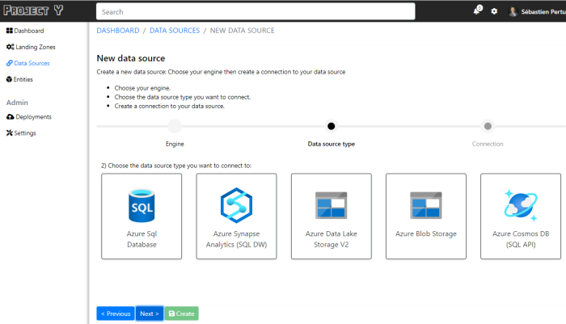

# Project Y

**Project Y** is a straightforward **Landing Zones** automated deployment tool dedicated to **data processing**.

> As definition, a **Landing Zone** is a full preconfigured cloud environment that can be used to host workloads, web applications, data processing ... with a set of cloud security options like vnet, access policies and so on...

That being said, **Project Y** allows any company to automatically deploy a landing zone for any company's team who needs a dedicated environment to process their own data without having to deal with a complex and long deployment.  
Once the dedicated landing zone deployed, **Project Y** allows the team to declare data sources and entities to be processed in the engine of their choice.

## What Project Y aiming to solve

Configuring a dedicated environment for a team can be quite complex and can lead to a long and heavy work, especially in large company where separation of concerns, security, vnet, authentication are high requirements.

Even more complex if we need to deploy several environments for differents teams withing your company.

Once the environment deployed, we still need to deploy all the classic components to be able to process data, like a process engine, a data lake, a metrics engine and so on...

**Project Y** will give a company the opportunity to:

- Allow any team in the company to ask for a full dedicated landing zone environment, completely automated, and available in a really short amount of time, once validated by the admin team in charge.
- Allow a team with a landing zone, to access and use a dedicated data processing pipeline
- Allow a team with a landing zone to declare data sources and entities without having to access the Azure Portal and the underlying services used.
- Allow advanced team users to personalize and create complex pipelines, and still backed by **Project Y**

## Project Y automation components

Once deploy, a dedicated **Project Y** landing zone is composed of:

- An Azure **Resource Group** dedicated to the team
- An Azure **Key Vault**
- An Azure **Databricks** Service Instance **OR** a **Synapse** Cluster
- An Azure **Application Insights** instance
- An Azure **Data Lake V2 Storage** account to store and process data
- An Azure **Data Factory V2** to orchestrate the workloads created by **Project Y**

## Project Y Workflow

From a team lead perspective, asking for a dedicated landing zone is fairly easy:

- Give a landing zone

Once deployed, the team will have access to the landing zone, and will be able to continue using Project Y to:

- Create data sources to connect
- Create entities to process
- Get a first data quality trends / charts

For advanced users, Project Y allows to:

- Give access to the **Spark Engine** (backed by **Databricks** or **Synapse**) to allow a user to create their own pipeline
- Give access to the **Data Factory** orchestrator to declare data sources not yet accessible from within **Project Y**.
- Give access to the **Application Insights** dashboards to create new dashboards and metrics
- Give access to the **Data Lake V2 Storage** to store and retrieve the pre-processed / processed data.

## Project Y website

### Request a new landing zone:

*ToDo*

### Declare a Data Source

*ToDo*

### Declare an entity

*ToDo*

### Admin engine deployment

*Todo*

