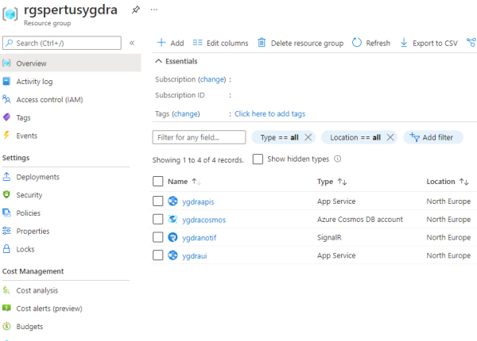

# SETUP

To be able to run **Project Y** website and all the background services, you firstly need to deploy some **Azure services**, and configure **authentication**.

> Note: **Project Y** and **Ygdra** means the same :)

## Prerequisites

- An Azure account with an active subscription. [Create an account for free.](https://azure.microsoft.com/free/dotnet)
- [Azure CLI](https://docs.microsoft.com/en-us/cli/azure/install-azure-cli)
- [.Net Core 3.1 SDK](https://dotnet.microsoft.com/download)
- [Visual Studio 2019](https://www.visualstudio.com/downloads) with the ASP.NET and web development workload.
  If you've already install Visual Studio 2019:
  - Install the latest updates in Visual Studio by selecting **Help > Check for Updates.**
  - Add the workload by selecting **Tools > Get Tools and Features.**

## Choose your deployment method

You have 2 readme files available to deploy everything you need:

[Setup Project Y By Script](SETUP_SCRIPT.md): This setup documentation uses a script to automatically creates everything for you.

[Setup Project Y Manually](SETUP_DETAILS.md): This setup documentation details all the steps you need to do manually, to eventually have a full solution deployed.

