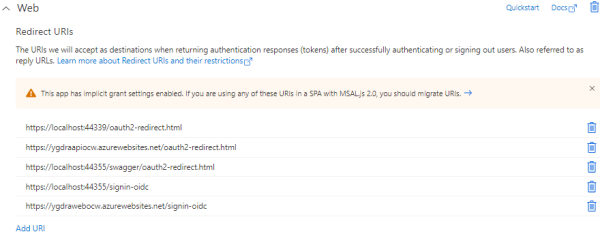

# SETUP PROJECT Y MANUALLY

## TL;DR

If you don't want to make a manual deployment of the infrastructure needed by **Project Y**, you can follow the [Setup By Script](SETUP_SCRIPT.md) documentation, to create everything automatically.

## Clone the solution

Clone the solution in your dev folder:

``` bash
git clone https://github.com/Mimetis/ProjectY.git
```

Once cloned, you can build the solution, using **Visual Studio 2019** or **Visual Studio Code**.

> Be sure to have .Net Core 3.1 installed on your system: [Get dotnet](https://dotnet.microsoft.com/download)

Once compiled, you need to:

- Create the **Azure Services** required by **Project Y** to run.
- Create a **Service Principal** required by **Project Y** to authenticate users.
- Create **2 appsettings files**, locally (one for dev / one for prod) to be able to start **Project Y** web app and web api.

As you can see, the **appsettings** file (in each project `Ygdra.Web.UI` and `Ygdra.Host`) are barely empty.

## Azure Services

**Project Y** will require the following to run:

- One **Resource Group** that will host the **Ygdra Core Services**.
- One **Azure Signal R Service** instance that will push notifications to users and to **Ygdra Core Services**.
  - When creating your Azure Signal R Service, please use **Default** service mode.
  - Using a free tier may not be sufficient since the number of messages could exceed the daily limit if you are doing lots of configurations.
- One **Azure CosmosDB** database that will store some Ygdra metadata and the `HangFire` running jobs.
  - Once the backend API (Host) is running, two databases will be created called `Ygdra` and `HangFire`.

For production, you can also choose to set up the following:

- Two **Azure Web App** in the previously created Resource Group:
  - First Web App will be used for the **Ygdra Web UI**.
  - Second Web App will be used to host the **Ygdra Web Api** services.
    - This Web App needs to have the `Always On` option, since we have some background services running by `HangFire`.

### Resource Group

1. Log in to the Azure portal and navigate to the subscription that you will be using for your deployment. In the navigation menu, select `Resource Groups` to see a list of current Resource Groups that already exist.
1. Click the `Add` link above the Resource Group list to go to the `Create a resource group` process.
    - On the **Basics** tab, verify the subscription is correct and type desired name of your resource group. This is where all of the resources for managing your deployment will be placed.
    - Select the region closest to you. (Make sure that all of the resources required are available in the region you selected.)
    - On the **Tags** tab if you want to add any optional metadata for your resource group.
    - On the **Review and create** tab, verify your choices and click `Create` to create the resource group.


> Note: In this tutorial, the location is "`North Europe`" and will be use everywhere. You can choose your own region depending on your needs.

### Web Apps

We need two Web Apps to run the solution:

- First Web App will be used for the **Ygdra Web UI**.
- Second Web App will be used to host the **Ygdra Web Api** services.
  - This Web App needs to have the `Always On` option, since we have some background services running by `HangFire`.

Here is the screenshot when creating the **app service** for the **Web UI** project:


> Note: In this tutorial, the Web App for UI will be `ygdraui` and the Web App for API will be `ygdraapis`.

Open your Web APIS Web app, then go to `Configuration` -> `General Settings`, and check you have the property `Always On` set to `On`


### Cosmos DB

We need a Cosmos DB to store the ygdra metadatas

1. On the list of resource groups, click the resource group you created for this deployment.
1. Click the `Add` link above the resources list and click `Marketplace` to add a resource.
    - In the `Create a resource` screen select `Azure Cosmos DB` from the list or use the search to locate "Cosmos DB"
    - On the **Basics** tab:
      - The "Subscription" and "Resource group" values should already be pre-filled. Verify they are correct.
      - Enter a value for the "Account Name", Leave the API as `Core (SQL)` and select the appropriate "Location".
      - The other values can be left with the defaults.
    - On the **Review + create** tab, verify your choices and click `Create` to create the Cosmos DB Account.


> Note: You don't need to create a database and any containers in your Cosmos DB account, since it will be done by **Project Y** on first start.

Once created, open the **Keys** page, and note your `Connection String`:


Your connection string should looks like

``` bash
AccountEndpoint=https://ygdraxxxxxxxxxx.documents.azure.com:443/;AccountKey=gWAxxxxxxxxxxxxxxxxxxxxxxxxxxx==;
```

### Signal R Services

We need a Signal R Services account that will push notifications to users and to Ygdra Core Services.

1. On the list of resource groups, click the resource group you created for this deployment.
1. Click the `Add` link above the resources list and click `Marketplace` to add a resource.
    - In the `Create a resource` search for `SignalR` and select `SignalR Service` from the drop down.
    - On the SignalR Service screen, click `Create` to start the `SignalR` process.
    - On the **Basics** tab:
      - The "Subscription" and "Resource group" values should already be pre-filled. Verify they are correct.
      - Enter a value for the "Resource Name" and select the appropriate "Region".
      - The other values can be left with the defaults.
    - On the **Review + create** tab, verify your choices and click `Create` to create the SignalR Service.


Once created, open the **Keys** page, and note your `Connection String`:


Your connection string should looks like

``` bash
Endpoint=https://ygdraxxxxxxx.service.signalr.net;AccessKey=xxxxxxxxxxxxxx;Version=1.0;
```

### Final output

Your resource group shoud looks like this:


## Azure Service Principal

During the provisioning process, **Project Y** will use a Service Principal to access some **Azure Services**.


This Service Principal will have have:

- RBAC assignments for **Contributor** and **Key Vault Contributor** to create resources and store their secrets in the key vault.
- Will be used to protect our `Ygdra.Host` Web Api.
- Will be used to authenticate your users.
- An application **Admin** Role, to allow specific users to access the Admin section from the web ui.

### Create the RBAC Service Principal

- Create an **RBAC Service Principal** for automation authentication.
- Then, add some specific role assignments to this SPN, needed by **Project Y**:
  - **Contributor** to be able to create Azure Resources.
  - **Key Vault Contributor** to be able to access the Project Y Key Vault.

``` bash
az ad sp create-for-rbac -n "ProjectYDemo" --role "Contributor"
{
  "appId": "XXXXX-XXXXX-XXXXX-XXXX",
  "displayName": "ProjectYDemo",
  "name": "http://ProjectYDemo",
  "password": "XXXXX-XXXXX-XXXXX-XXXX",
  "tenant": "XXXXX-XXXXX-XXXXX-XXXX"
}

az role assignment create --assignee <appId> --role "Key Vault Contributor"

# Otherwise, for an existing SPN, you can use this az role assignement command line:
# az role assignment create --assignee <appId> --role "Contributor"
# az role assignment create --assignee <appId> --role "Key Vault Contributor"

```

From the results output from the CLI, make note of the following:

- `appId`: Will be used as `ClientID` in the appsettings.
- `password`: Will be used as `ClientSecret` in appsettings.
- `tenant`: Will be used as `TenantId` in appsettings.

We need the underlying Managed Identity Object Id, from the Service Principal.  
You can get it with from this command line:

``` bash
az ad sp show --id <appId> --query objectId
AAAA-AAAA-AAAA-AAAA
```

- The output value will be used as `ClientObjectId` in the appsettings.

### Application / Web app Authentication

From the Azure Portal, go to Azure Active Directory -> App Registrations.  
Choose your newly created Application (called **ProjectYDemo** refering the previous script in this walkthrough)  


We will configure this SPN, through all the sections available on the left menu:

#### Authentication

From your Application go to **Authentication** section, and add some web redirections:

> We can use the same SPN for both prod and dev. So far, each url will be submitted twice.  
One for localhost dev mode, and one for production mode.

Redirection for **Ygdra.Host**:

- https://[YgdraWebApiName].azurewebsites.net/oauth2-redirect.html
- https://localhost:44339/oauth2-redirect.html

Redirection for **Ygrdra.Web.UI**:

- https://[YgdraWebUiName].azurewebsites.net/signin-oidc
- https://localhost:44355/signin-oidc



Be sure to check `Acess tokens` and `ID tokens` (We need both, especially for **Swagger**)  
Then allow accounts in any organization (Project Y uses the `/common` endpoint)


#### Certificate and Secrets

From your Application go to **Certificates and secrets**, and generate your secret.
Be sure to note this secret somewhere. You will need it in your appsettings files.

#### Web Api protection

From your Application go to **Expose an API** section, and edit the Application ID URI.  
This application ID Uri should looks like:

`https://{YOURDOMAIN}.onmicrosoft.com/{CLIENT_ID}`

Then, add a new scope:

- **Scope Name**: user_impersonation
- **Who can Consent**: Admins and Users

The newly scope should looks like `https://{YOUR_DOMAIN}.onmicrosoft.com/{CLIENT_ID}/user_impersonation`

From your Application go to **Api Permissions** section, and add permissions:

- **Microsoft Graph** : User.Read, User.ReadBasic.All
- **Your API** : user_impersonation


#### Create the Admin Role

From your Application, Go to **App Roles** and create a new app role:

- **Display Name**: Admin
- **Allowed members types**: Users/Groups
- **Value**: Admin (this value MUST be 'Admin' since it's used in the Ygdra code)
- **Description**: Ygdra Administrators
- **Do you want to enable this app role**: Yes


#### Add your user to Admin Role

From your Application go to **Overview** section, then click on your **Managed Application in local directory**  Entreprise Application link.  
You will be redirected to the Managed Identity that supports your Application.

> You should see now, from the Entreprise Application properties, the Object ID value, that we get from the `az ad sp show --id <appId> --query objectId` query, previously.

From your Entreprise Application, go to **Users and Groups** section.  
Then assign your user to the **Admin** role.

## Azure Web Apps Configuration

Once you have cloned the `Poject Y` repository, please add a new `appsettings.Development.json` file (and `appsettings.Production.json` when you will deploy into production)

> **Note:** These two files are part of the `.gitignore` file, and then, will not be commited to the Github repository.

Configuration for the Azure Web Api project `Ygdra.Host`:

``` jsonc
{
  "AzureAd": {
    "Instance": "https://login.microsoftonline.com/",
    "Domain": "yourdomain.onmicrosoft.com", // Domain of your tenant. For example contoso.onmicrosoft.com
    "TenantId": "", // Tenant Id of your domain. You can find it from the Azure Active Directory Blade Overview Page
    "SubscriptionId": "", // Subscription Id where everything will be deployed. You can find it from the Azure Subcriptions Blade
    "ClientId": "", // Client Id of your Service Principal 
    "ClientObjectId": "", // Client Object Id from your Service Principal. Not the Application ID, the underline Managed Application ID !
    "ClientSecret": "", // Client Secret from your Service Principal
    "CallbackPath": "/signin-oidc"
  },
  "Graph": {
    "BaseAddress": "https://graph.microsoft.com/beta",
    "Scopes": "User.Read User.ReadBasic.All"
  },
  "YgdraServices": {
    "BaseAddress": "", // Ygdra Web Api Core Http Url. Something like "https://localhost:44339" if running locally, or something like "https://<YgdraWebApiName>.azurewebsites.net" if running from Azure
    "Scopes": "user_impersonation"
  },
  "YProvider": {
    "Provider": "YCosmosDbProvider",
    "Endpoint": "", // Ygdra Cosmos DB web url. Something like "https://<YgdraCosmosDbName>.documents.azure.com:443"
    "AccountKey": "", // CosmosDB Account Key
    "Database": "Ygdra",
    "Container": "Ygdra"
  },
  "HangFire": {
    "Endpoint": "", // HangFire will save everything on CosmosDB. Endpoint is the CosmosDB Web Url. Something like "https://<YgdraCosmosDbName>.documents.azure.com:443"
    "AccountKey": "", // Cosmos DB Account Key
    "Database": "Ygdra",
    "Container": "Hangfire"
  },
  "SignalR": {
    "ConnectionString": "" // Signal R Service Connection String. Something like "Endpoint=https://....;AccessKey=....;Version=..;"
  },
  "Logging": {
    "LogLevel": {
      "Default": "Information",
      "Microsoft": "Warning",
      "Microsoft.Hosting.Lifetime": "Information"
    }
  }
}
```

Configuration for the Azure Web UI project `Ygdra.Web.UI`:

``` jsonc
{
  "AzureAd": {
    "Instance": "https://login.microsoftonline.com/",
    "Domain": "yourdomain.onmicrosoft.com", // Domain of your tenant. For example contoso.onmicrosoft.com
    "TenantId": "", // Tenant Id of your domain. You can find it from the Azure Active Directory Blade Overview Page
    "SubscriptionId": "", // Subscription Id where everything will be deployed. You can find it from the Azure Subcriptions Blade
    "ClientId": "", // Client Id of your Service Principal 
    "ClientObjectId": "", // Client Object Id from your Service Principal
    "ClientSecret": "", // Client Secret from your Service Principal
    "CallbackPath": "/signin-oidc"
  },
  "Graph": {
    "BaseAddress": "https://graph.microsoft.com/beta",
    "Scopes": "User.Read User.ReadBasic.All"
  },
  "YgdraServices": {
    "BaseAddress": "", // Ygdra Web Api Core Http Url. Something like "https://localhost:44339" if running locally, or something like "https://<YgdraWebApiName>.azurewebsites.net" if running from Azure
    "Scopes": "user_impersonation"
  },
  "SignalR": {
    "ConnectionString": "" // Signal R Service Connection String. Something like "Endpoint=https://....;AccessKey=....;Version=..;"
  },
  "Logging": {
    "LogLevel": {
      "Default": "Information",
      "Microsoft": "Warning",
      "Microsoft.Hosting.Lifetime": "Information"
    }
  }
}
```
