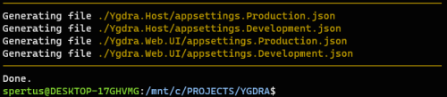
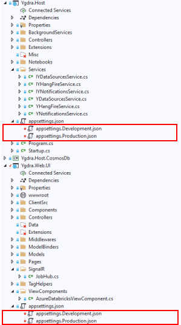
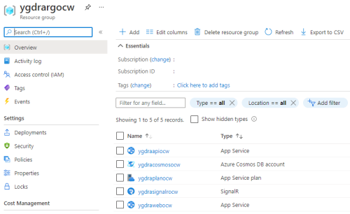
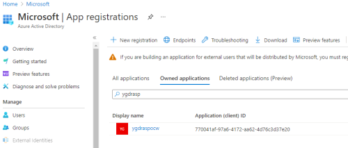

# SETUP PROJECT Y BY SCRIPT

This documentation describes how to deploy the core components of **Project Y**, through an automated script.
> If you want to do it manually, check the [Setup In Details](SETUP_DETAILS.md) documentation

## Clone the solution

Clone the solution in your dev folder:

``` bash
git clone https://github.com/Mimetis/ProjectY.git
```

Once cloned, you can build the solution, using **Visual Studio 2019** or **Visual Studio Code**.

> Be sure to have .Net Core 3.1 installed on your system: [Get dotnet](https://dotnet.microsoft.com/download)

Once compiled, you need to:

- Create the **Azure Services** required by **Project Y** to run.
- Create a **Service Principal** required by **Project Y** to authenticate users.
- Create **2 appsettings files**, locally (one for dev / one for prod) to be able to start **Project Y** web app and web api.

As you can see, the **appsettings** file (in each project `Ygdra.Web.UI` and `Ygdra.Host`) are barely empty.

The [setup.sh](setup.sh) file will do everything for you.

## Script setup.sh

The bash script `setup.sh` will create all the services and the service principal to be able to deploy the solution in your subscription.  
Then the script will create all the **appsettings files** for all the projects (web / api) that require them.

> Note: These generated files (`appsettings.developement.json` and `appsettings.production.json`) are explicitly part of the .gitignore file. They will never be commited to Github.

Be sure to:

- Be the **Owner** of your subscription to authorize the script to deploy all the required services.
- Be **logged** into your account from you command line (using `az login`)
- **Run** the script from **WSL** (or any system supporting bash scripts)
  - Be sure your console root folder is the folder where the script is.

Running the script is pretty straightforward:

``` bash

# bash setup.sh -p [RANDOM_PREFIX] -s [RANDOM_SUFFIX] -l [LOCATION]

# -p: A random Prefix that will be append at the begining of each created resources.
# -s: A random Suffix that will be added at the end of each created resources.
# -l: Deployment location. Default is "NorthEurope"
# -d: Subscription Domain used: Default is "microsoft.onmicrosoft.com"
```

`SUFFIX` and `PREFIX` are meant to be used to have **unique generated names** for your azure services.

Here is an example using `-p` and `-s`

``` bash

# Example
bash setup.sh -p ygdra -s ocw
```

This script will create:

- A **resouce group** called **ydrargocw**
- A **web app** for UI called **ydrawebocw**
- A **web app** for API called **ydraapiocw**
- A **cosmos db** instance called **ydracosmosocw**
- A **signalr services** instance called **ydrasignalrocw**
- A **service principal** called **ydraspocw**

The script will take approximatively 5 minutes to execute.  
At the end, you should have an ouptut containing a **JSON** fragment, like this:


And finally, the script will create all the appsettings files for you:



You can check that you have 2 new files in each projects:



And you can check that you have a **new resource group** in your subscription, with all the **services** deployed:



Finally, you can check you have a service principal created for you that will be used by the **Project Y** web applications / web api.



If you want to know more about what the script does behind the scene, you can check the [Setup In Details](SETUP_DETAILS.md) documentation, where we are creating everything manually.
